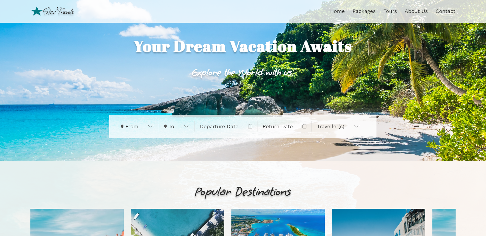
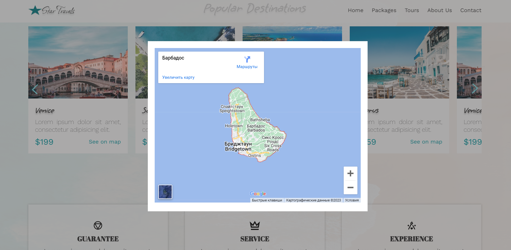

# Travel Agency

This educational project is a landing page for a tour agency. It is built using HTML, CSS, and JavaScript, with a focus on object-oriented programming (OOP) principles. The landing page features a carousel displaying popular destinations and allows users to view each of destination on map displayed as a modal window.

## Features

- **Responsive Design:** The landing page is designed to be fully responsive and adapts to different screen sizes.
- **Carousel:** The "Popular Destinations" section includes a carousel made on vanilla JS to showcase various travel destinations.
- **Interactive Map:** Users can view popular destinations on an interactive map within a modal window.
- **Burger Menu:** On smaller screens, a burger menu is available for easy navigation.

## Tech Stack

- HTML
- CSS
- JavaScript

## Access the App

You can access the application at the following link: [Travel Agency ](https://nataly-horbunova.github.io/travel_agency/)

## Screenshots

## Getting Started

git clone https://github.com/Nataly-Horbunova/travel_agency.git

cd travel_agency
